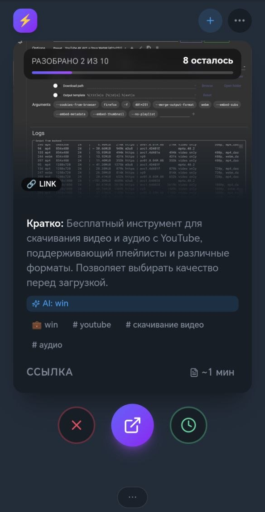
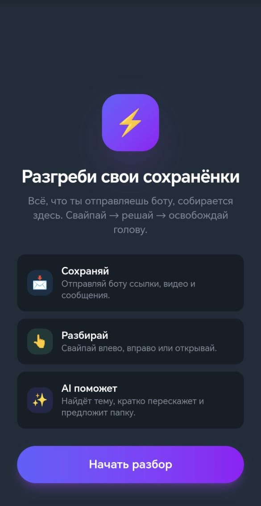
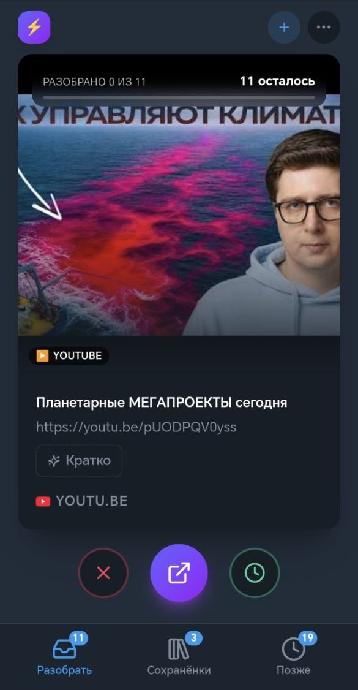
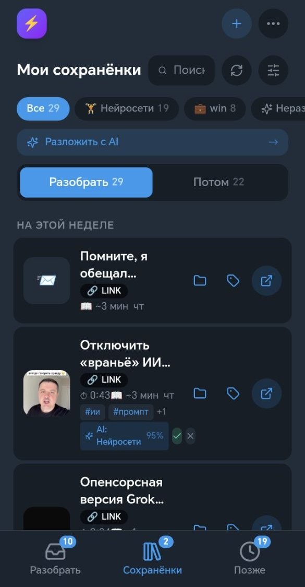
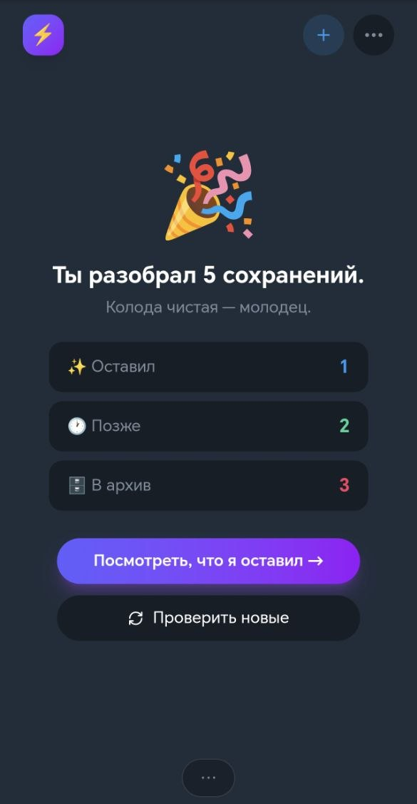
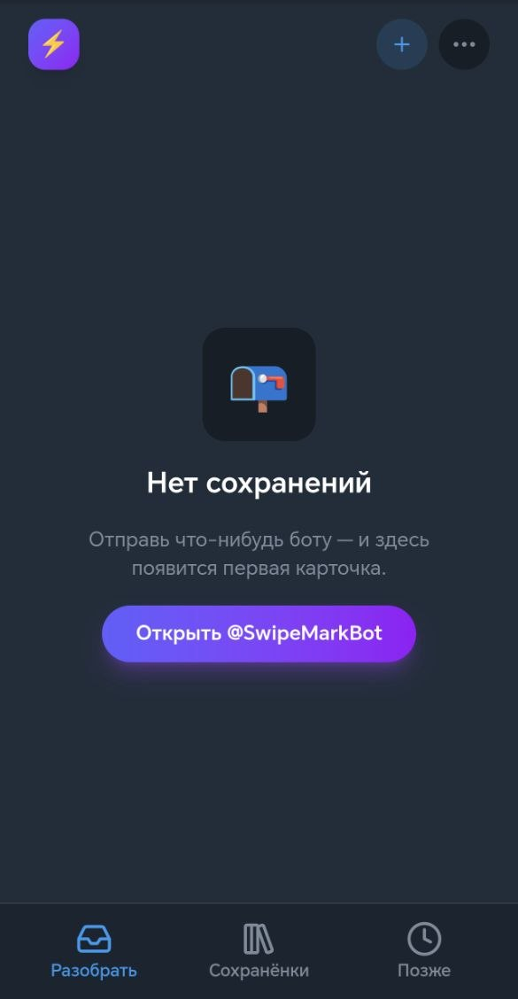

  <b>Русский</b> · <a href="./README_EN.md">English</a>

# SwipeMark

### Преврати сохранёнки из Telegram в организованную библиотеку.

Отправляй ссылки, видео и сообщения боту в Telegram.
Потом разбирай их свайпами: оставляй важное и архивируй остальное.

[🚀 Попробовать SwipeMark](https://alexvalyavin.github.io/swipe-mark-bot/) · [💬 Открыть бота](https://t.me/SwipeMarkBot/app)

---

## Демо

_Добавь сюда GIF на 10–15 секунд: отправь ссылку → открой SwipeMark → свайпай → свайпай → готово._

---

## Проблема

Мы сохраняем всё:

- видео с YouTube
- посты из Instagram
- TikTok
- статьи
- сообщения из Telegram
- то, что хотим прочитать «потом»

И в итоге — сотни сохранёнок, к которым мы так и не возвращаемся.

## Идея

SwipeMark превращает накопленные сохранения в простую колоду для свайпов.

Открой карточку.
Реши, что с ней делать.
Иди дальше.

## Возможности

- 📥 Сохранение из Telegram
- 👆 Сортировка свайпами
- 🔗 Ссылки / YouTube / Instagram / TikTok
- 📝 Сообщения из Telegram
- 📁 Папки и теги
- ✨ Краткие пересказы
- 🤖 Помощь ИИ в организации
- 📱 Telegram Mini App
- 🌐 PWA

## Как это работает

1. Отправь что-нибудь боту
2. Открой SwipeMark
3. Свайпай по сохранениям
4. Оставляй, архивируй или откладывай
5. Находи всё потом

## Скриншоты

## Дорожная карта

- [x] Telegram-бот
- [x] Mini App
- [x] Сортировка свайпами
- [x] Библиотека
- [x] Папки
- [x] Разные источники контента
- [x] ИИ-пересказы

- [ ] Публичная бета
- [ ] PWA
- [ ] ИИ-ассистент
- [ ] Premium

## CTA

У тебя есть гора неразобранных сохранений?
Попробуй SwipeMark.

[🚀 Попробовать SwipeMark](https://alexvalyavin.github.io/swipe-mark-bot/) · [💬 Открыть бота](https://t.me/SwipeMarkBot/app)

---

## Лицензия

© 2026 Alex Valyavin. All rights reserved. The source code is proprietary and may not be copied, modified, distributed, or used without prior written permission.